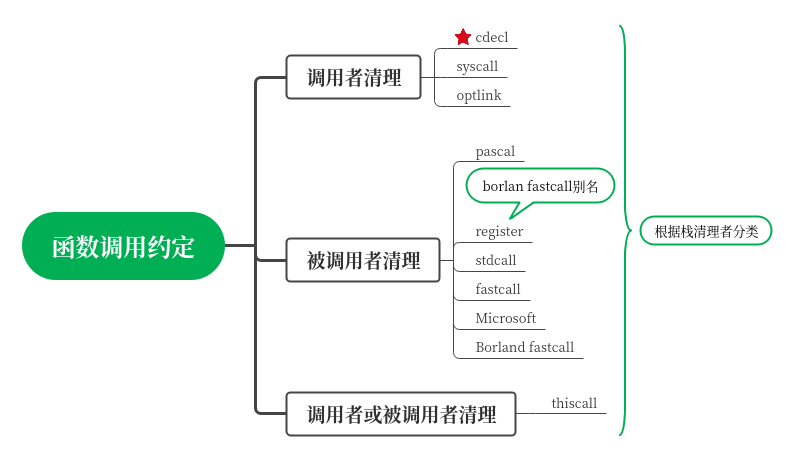

# <h1 align="center">N007 汇编与C语言混合编程</h1>

## 一、学习目标

* [ ] 函数调用约定
* [ ] 汇编和C语言混合编程
* [ ] 内联汇编

## 二、笔记内容

### 1、函数调用约定

C的编程中，各个函数之间可以相互调用，在调用这个过程中，需要传递参数，返回结果。

为了解函数之间如何协作，需要考虑以下问题：

* 参数保存在的位置

在之前写的汇编程序中，一直把参数保存在寄存器中，参数顺序如何，但在cPutChar中则把参数保存在栈中，也就是内存中,如果保存在内存中压入顺序如何？。

* 返回值保存的位置

函数有的返回数值（int、long、longlong），有的返回地址，有的无返回，这个返回值保存在哪里也是个问题。

* 栈清理问题

根据参数保存的位置，当参数保存在栈中时，谁来负责清理栈中的内容（栈平衡问题）。

为了解决上述问题，各个编译器都有自己的`调用约定(Calling Conventions)`，根据谁负责清理分出几个类别，简单预览如下：



项目中使用GCC和C语言编程，因此主要介绍`cdecl`:

| 项目             | 描述                                 | 备注                            |
| ---------------- | ------------------------------------ | ------------------------------------ |
| 参数传递         | 把参数保存在栈中，由调用者从右到左压入栈中 |  |
|       寄存器保存          | EAX、ECX、和EDX由调用者保存，其他由被调用者保存 | ? |
| 存返回值 | 保存在EAX中 | 疑问：大数怎么保存？ |
| 栈清理 | 调用者清理 |  |

### 2、汇编和C语言混合编程

有了上面的基础，C和汇编可以相互调用了。

print.asm

```assembly
global cPutChar         ; 到处标号供外部使用

[BITS 32]
[SECTION .text]
;函数名：cPutChar
;参数：color(1B), char(1B)，按cdecl调用协议，把参数保存在栈中，从右往左开始压入参数，由调用者清理。
;返回：无
cPutChar:
    pushad       ; 入栈顺序是EAX、ECX、EDX、EBX、ESP、EBP、ESI、EDI
    ; 初始化数据位置
    mov ax, 1 << 3 + 0
    mov gs, ax
    mov ebp, esp	; ebp待会用来访问栈中参数
    ; 省略
.getChar:
    ; 调用的时候会压入4字节地址
    ; 获取颜色
    mov edx, [ebp + 36]      ; 所有寄存器的值,4*8=32,加上主调函数的返回地址4字节,故esp+36
    ; 获取字符
    mov eax, [ebp + 40]      ; 在颜色后压入字符的值
    mov ah, dl               ; ax中保存带颜色的字符
    cmp al, 0x0A
    ;省略
.putEnd:
    popad
    ret
```

print.h

```c
#ifndef KERNEL_LIB_PRINT_H
#define KERNEL_LIB_PRINT_H
typedef unsigned char uint8;
void cPutChar(uint8 color, uint8 asciiCh);
#endif
```

kernel.c

```c
#include "print.h"
void kernelMain(void)
{
    cPutChar(0x07,'\n');
    cPutChar(0x07,'\n');
    cPutChar(0x07,'\n');
    cPutChar(0x07,'\n');
    cPutChar(4,'A');
    cPutChar(4,'B');
    cPutChar(4,'C');
    cPutChar(4,'\b');
    cPutChar(4,'D');
    while (1);
}
```

### 3、内联汇编

对于简短的汇编内容，可以直接写到C语言中，称之为`内联汇编`。

## 三、参考资料

【书】操作系统真像还原 第6章
