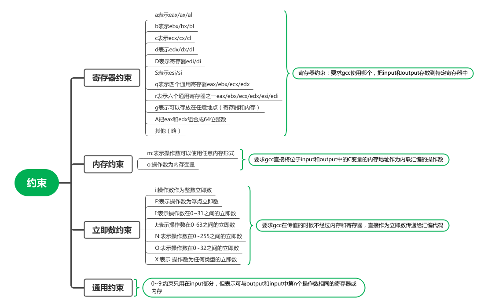

# <h1 align="center">内联汇编</h1>

gcc支持在C代码中嵌入汇编代码，称为`内联汇编（inline assembly）`。

## 一、学习目标

* 了解AT&T汇编语法
* 了解基础内联汇编
* 了解扩展内联汇编

## 二、Intel汇编语法与AT&T汇编语法

内联汇编使用的是`Intel汇编语法，因此需要了解AT&T汇编语法。

nasm汇编编译器使用的汇编代码是Intel风格的，比如：

```assembly
;Intel语法： 操作 目的寄存器，源数据/立即数
mov ax, 0x1234
```

gcc内联汇编则比Intel语法有跟多的要求，比如：

```assembly
; AT&T语法：操作 源寄存器/立即数，目的寄存器
movw $0x1232, %ax
```

以下是一些区别：

| 区别     | Intel                                     | AT&T                           | 说明                                            |
| ------ | ----------------------------------------- | ------------------------------ | --------------------------------------------- |
| 寄存器    | 寄存器无前缀                                    | 寄存器前需要前缀%                      |                                               |
| 操作数顺序  | 目的操作数在左，源操作数在右                            | 目的操作数在右，源操作数在左                 |                                               |
| 操作指定大小 | 有关内存的操作时需要加数据类型修饰符，比如mov bye[0x1234] , al | 在指令后面加数据累心，比如，movb 0x1234,%ax, |                                               |
| 立即数    | 没有前缀                                      | 需要加前缀$                         |                                               |
| 远跳转    | jmp far segment:offset                    | ljmp \$segment:$offset         |                                               |
| 远调用    | call far label                            | lcall \$segment:$offset        |                                               |
| 远返回    | ret far n                                 | Iret $n                        |                                               |
| 寻址     | mov eax, ds:[si+立即数]                      | mov baseVal(%ebx, %esi, esi倍数) | 这里只是简单的举例，寻址比较复杂，比如不明确标出段寄存器时，bp,bx等等决定了段寄存器。 |

## 三、基础内联汇编

### 1、基础语法：

```c
asm [volatile] ("assembly code")
```

* asm是固定的语法，与\__asm__是一个样的
* volatitle关键字告诉编译器不要优化汇编代码
* assembly code规则：
  * 汇编代码必须被双引号包围，无论是一行还是多行
  * 双引号之间不能跨行，需要跨行时用`\`转义
  * 每条汇编代码之间用`;`分割

比如：

```c
int main(){
    asm volatile ("\
    mov eax, 1; \
    mov ebx, 2");
}
```

## 四、扩展内联汇编

基础内联汇编功能不够强大，因此引入扩展内联汇编。

### 1、基础语法模板

```c
asm [volatile] ("assembly code":output:input:clobber/modify)
```

相比基础内联汇编，它多了output、intput和clobber/modify。

* output 用来约束输出

语法：`“[操作数修饰符]约束名”(C变量名)`

* input 用来约束输入

语法：`“[操作数修饰符]约束名”(C变量名)`

* 声明汇编代码破坏的寄存器或内存，以便c编译器对这些寄存器和内存的保护

编译器可以跟踪识别一些显式的寄存器使用情况，但有的无法跟踪（比如函数调用），此时需要开发者明确地告诉编译器使用了哪些资源。

语法:`"寄存器名/cc/memory"`

（1）寄存器资源被使用时，写入寄存器名，比如edx被使用，可以写ax、al，多个寄存器用"，"分开

（2）eflags被更改注明`cc`

（3）内存被修改注明`memory`

### 2、约束用来描述C变量如何变成汇编操作数:



### 3、占位符、操作数修饰符、操作码

#### （1）占位符

占位符分成两种，一种是`序号占位符`、一种是`名称占位符`。

* 序号占位符
  
    `0~9`共10个，前面加`%`

* 名称占位符

加入名称占位符时，input和output格式变成了：

`[名称占位符]“[操作修饰符]约束名”(c变脸名)`

```c
#include <stdio.h>
int main(){
    int a = 1, b =3 , c = 1;
    int d;
    /* d = a + b + c
     * %1 %2 %3 是占位符，代表a、b、c对应的寄存器
     * result是名称占位符，对应着d对应的寄存器
     */
    asm volatile (
    "addl %1,%2;\
     addl %2,%3;\
     movl %3,%[result];\
    ":[result]"=a"(d):"b"(a),"c"(b), "d"(c));
    printf("SUM = %d\n",d);
    return 0;
}
```

#### （2）操作修饰符

操作修饰符，用来修饰所约束的操作数，指明内存、寄存器在output和input中如何使用。

| 操作数修饰符 | 作用                                        | 使用位置   |
|:------:| ----------------------------------------- | ------ |
| =      | 表示只写                                      | output |
| +      | 读写，内存或寄存器先被读入，再被写入                        | output |
| &      | 表示操作数独占所分配的寄存器，只供output使用，任何input中都不能与之相同 | output |
| %      | 该操作数可以和下一个操作数互换                           |        |

#### （3）操作码

在编写汇编代码的过程中，有时需要指定特定的寄存器，比如端口的读取，数据保存在al中，端口保存在dx中。

前面的寄存器约束中a可能代表了`eax`、`ax`、`al`,有了操作码，就可以指定所需要的寄存器了。

这些操作码被定义在了整形机器模式中，在学习和开发的过程中以下操作码应该够用了：

* h:1个字节，使用寄存器的高8位，比如：ah, bh
* b：1个字节，使用寄存器的低8位，比如：al, bl
* w: 使用2个字节的部分，比如ax, bx
* k: 使用4个字节的部分，比如eax, ebx

## 五、参考资料

操作系统真像还原 6.4节
