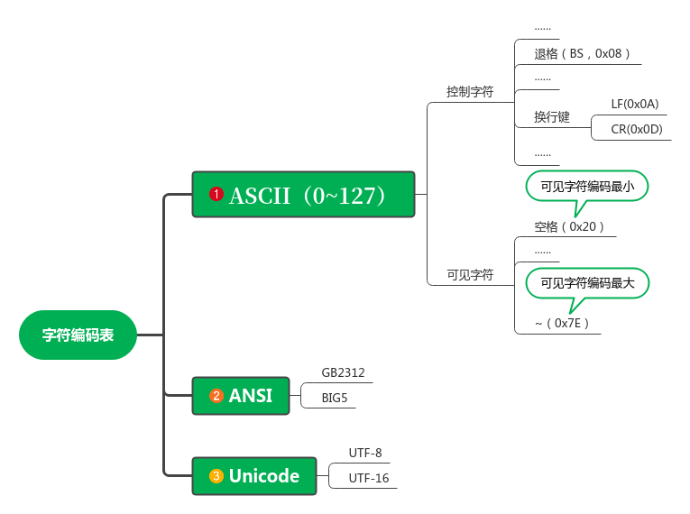

# <h1 align="center">彩色cPutChar</h1>

## 一、学习目标

* [x] 了解字符编码
* [x] 了解显卡控制
* [x] 字符颜色
* [x] 设计cPutChar

### 二、笔记内容

### 1 字符编码



### 2 显卡的简单操作

0xB8000~0xBFFFF这32KB属于文字模式适配器，我们选用的是80*25 16色模式。大约可以显示8屏。

cPutChar需要`显存操作`、`光标操作（读取光标位置和设置光标位置）`。

此处着重学习光标操作，操作逻辑步骤如下。

```
1、向寄存器索引端口写入寄存器索引值
2、数据端口读取或写入数据
```

光标的位置由高8位和低8位构成，读取时需要先读高8位在读低8位，写的时候也一样。

* 相关端口

|  端口  | 描述           |
| :----: | -------------- |
| 0x03D4 | 寄存器索引端口 |
| 0c03D5 | 数据端口(8位)  |

* 寄存器索引

| 索引 | 描述      |
| :--: | --------- |
| 0x0E | 光标高8位 |
| 0x0F | 光标低8位 |

### 3 字符颜色

之前就一直在使用彩色的字符打印，下面是字符模式下字符的颜色。

0xB8000=color, 0xB8001=字符编码

<table>
    <tr>
        <td>位</td><td>7</td><td>6</td><td>5</td><td>4</td><td>3</td><td>2</td><td>1</td><td>0</td>
    </tr>
    <tr>
        <td>描述</td><td>闪烁</td><td colspan="3">背景色</td><td>亮度</td><td colspan="3">前景色</td>
    </tr>
    <tr>
        <td>属性</td><td>K</td><td>R</td><td>G</td><td>B</td><td>I</td><td>R</td><td>G</td><td>B</td>
    </tr>
</table>

其中，K位置为1时，可以看到闪烁的画面，I影响颜色的亮度，比如RGB置为`111`,且I置1时为亮白。

### 4 设计cPutChar

```assembly
;函数名：cPutChar
;参数：color, char，按cdecl调用协议，把参数保存在栈中，从右往左开始压入参数，由调用者清理。
;返回：无
;步骤：
; 保存寄存器环境
; 获取光标位置
; 判断可显示字符还是控制字符
; backspace
; normalChar
; newLine
; 查看是否需要滚屏
; 设置光标
; 恢复寄存器
```

