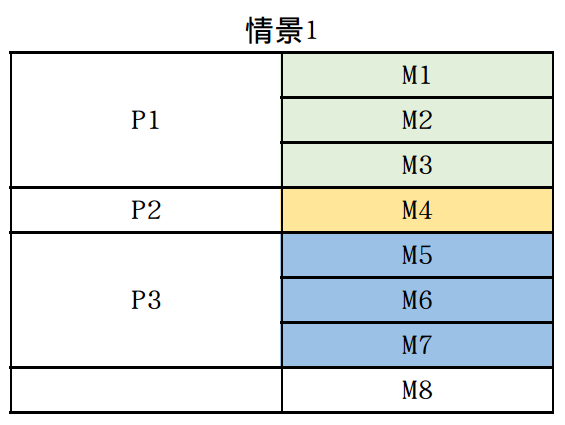
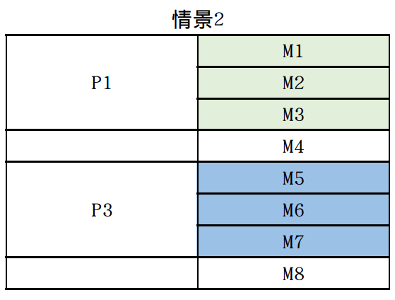
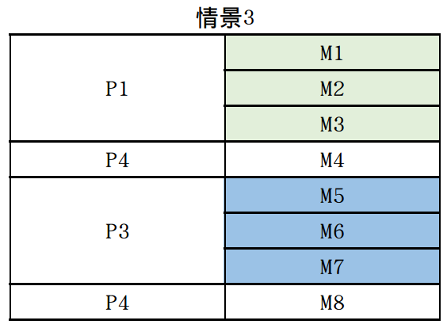

#  <h1 align="center">启用内存分页<h1>

## 一、学习目标

* [ ] 内存分页解决的问题
* [ ] 逻辑地址、线性地址和物理地址之间的转换
* [ ] 内核空间设计

## 二、笔记内容

### 1、内存分页解决的问题

在分段机制下，会出现有足够的内存空间，但无法载入新的程序，这是由内存分段碎片化造成的。

* 分页机制的思想是： 通过映射，可以是连续的线性地址与任意物理内存地址相关联。

因此，逻辑上连续的线性地址对应的物理地址可以不连续。

---



情景1：进程P1、P2、P3正在运行，其中P1占用内存M1、M2和M3, P2占用M4, P3占用M5~M8。




情景2：P2运行完成、新的进程P4需要运行，但它需要两内存区块，此时内存余量足够但无法运行P4。




情景3：启用分页机制后可以利用空碎片化的空间。

---

如果内存空间还是不够，可以把暂停中的进程保存进硬盘，把即刻需要运行的进程加载进内存运行。

### 2、逻辑地址、线性地址和物理地址之间的转换

在进入保护模式的时候已经初步了解过`逻辑地址`、`线性地址`和`物理地址`之间的关系。


开启分页需要引入新的概念。

* `重要：把数据保存在内存中是一个十分重要而朴素的想法。`

#### （1）分页下的线性地址

启用分页后，`线性地址`不再是物理地址，它被分成了三个部分。

| 数据名称 |  Dir  | Table | offset |
| :------: | :---: | :---: | :----: |
| 数据位置 | 31~22 | 21~12 |  11~0  |

* Dir

    共10位，用来保存页目录表的下标

* Table

    保存`页表`的`页表项`下标

* offset

    物理页的页内偏移地址。

#### （2）页目录表（Page Directory）和页目录表项(Page Directory Entry)

* 页目录表项

    用来保存`页表`的`物理地址`和页表的属性，每项共4字节。

    | 位偏移 |        31~12        | 11~9 |  8   | 7    | 6    |  5   |  4   |  3   |  2   |  1   |  0   |
    | :----: | :-----------------: | :--: | :--: | ---- | ---- | :--: | :--: | :--: | :--: | :--: | :--: |
    |  属性  | 页表物理地址31~12位 | AVL  |  G   | 0    | D    |  A   | PCD  | PWT  |  US  |  RW  |  P   |

* 页目录表

    一级页表，只有一个，保存页目录项，共4KB,可以保存4KB / 4B = 1024个目录项。

#### （3）页表(Page Table)和页表项（Page Table）

* 页表项

    用来保存对应物理页的起始物理地址和属性，每项4字节。

| 位偏移 |        31~12        | 11~9 |  8   | 7    | 6    |  5   |  4   |  3   |  2   |  1   |  0   |
| :----: | :-----------------: | :--: | :--: | ---- | ---- | :--: | :--: | :--: | :--: | :--: | :--: |
|  属性  | 页表物理地址31~12位 | AVL  |  G   | PAT  | D    |  A   | PCD  | PWT  |  US  |  RW  |  P   |

* 页表

​	二级页表，每页4KB，至多有1024个。每个页表可以访问的范围为1024个页表项 * 4KB = 4MB。


* 通过这两级页表，可以访问的内存达 ：1个页目录表 * 1024个页表 * 1024个页表项 * 4KB每页表 = 4GB

#### （4）三个地址之间的转换

```
1、逻辑地址=选择子：偏移地址
2、线性地址：从段描述符中取出段基址 + 偏移地址
3、物理地址：
	（1）在物理地址"地址页目录表地址 + DIR * 4" 处获得页表的物理地址；
	（2）在物理地址“页表物理地址 + Table * 4”处获得物理页的物理地址；
	（3）物理地址 = 物理页的物理地址+offset
```

#### (5) 页目录表项和页表项属性说明

| 属性 | 说明                                                         |      |
| :--: | ------------------------------------------------------------ | ---- |
| AVL  | Available， 表示软件、操作系统可以使用该位。                 |      |
|  G   | Global，全局位。置1时表示页是全局页，0是为非全局页。若为全局页时该页将一直存在TLB中。 |      |
| PAT  | Page Attribute Table， 页属性位，能设置页的粒度，学习中置1   | ？   |
|  D   | Dirty，脏页位。CPU对一个页进行操作时置为1，仅对页表项生效    |      |
|  A   | Access， 访问位。置1时表示被CPU访问过，此外配合P位实现内存的换出和换进，还可以用来统计使用的次数 |      |
| PCD  | Page-level Cache Write Disable, 页级高速缓存禁止位，1时启用高速缓存，0时不启用，学习中不启用，置0 |      |
| PWT  | Page-level Cache Write Through, 页级通写位，1时表示该页不仅是内存还是高速缓存，学习中置0 |      |
|  US  | User/Supervisor位，1时表示用户级，0~3级都可以访问，0表示监管级，0~2级都可以访问 |      |
|  RW  | Read/Wirte位，1表示可读写，0为不可读写                       |      |
|  P   | present,存在位，1表示页存在内存中，0表示不存在，通过与page fault配合实现虚拟内存的管理 |      |


### 3、快表TLB（Translation Lookaside Buffer）

分页机制虽然灵活，但转换过程过于复杂，于是在CPU中增加一个高速缓存，用来保存`虚拟地址页框`与`物理地址页框`。

CPU不主动维护TLB,需要操作系统开发者自己维护，可以通过指令`invlpg`，比如invlpg addr表示更新，addr对应虚拟地址的条目，此外还可以通过重新加载`cr3`来刷新TLB。

### 4、开启内存分页的过程

```
1、准备页表
; 2、保存和更新GDT数据
3、更新指针数据（栈指针）
4、加载cr3
5、开启cr0 pg 位
6、加载新的GDT
```

### 5、内核空间设计

0~3GB分配给用户程序，3~4GB分配给操作系统内核，即虚拟地址0x0000_0000~0xBFFF_FFFF属于用户程序，虚拟地址0xC000_0000~0xFFFF_FFFF属于内核。

由于：

* 操作系统放从1MB处开始存放，预留1MB的空间
* 操作系统虚拟地址从0xC000_0000开始，物理地址低2MB内
* 操作系统的页目录表从2MB开始存放，4KB
* 紧接着存放操作系统的第一个页表，4KB
* 在没有重新加载新的GDT前需要访问到0x0000_0000~0x0010_0000

所以：

* 第一个页表映射至物理地址0x0000_0000~0x0020_0000，共2MB

* 页目录表第0个PDE映射至第一个页表
* 页目录表第768个PDE映射至第一个页表
* 页目录表第1023个PDE映射指向页目录表本身（产生多余的映射关系）

## 三、注意事项

* 在开启分页模式后，所有地址都会被解释成虚拟地址，需要开发者自己维护，这是把虚拟地址0x0000_0000~0x001F_FFFF映射至物理地址0x0000_0000~0x001F_FFFF的原因。

##  四、参考资料

操作系统真像还原  5.2节
