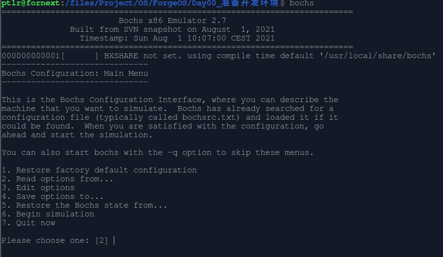
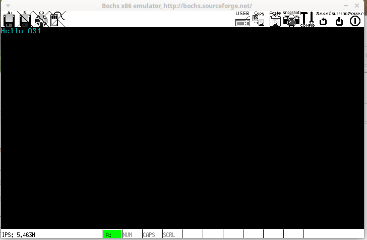

# <h1 align="center">N00 准备开发环境</h1>

## 一、目标

* [x] 搭建开发环境
* [x] 运行测试程序


## 二、步骤

> * [ ] 搭建开发环境
> > ### 1、安装nasm
> >
> > ```bash
> > sudo apt intall nasm -y
> > ```
> >
> > ### 2、安装gcc、g++
> >
> > ```bash
> > sudo apt install gcc -y
> > sudo apt install g++ -y
> > ```
> >
> > ### 3、安装make
> >
> > ```bash
> > sudo apt install make
> > ```
> >
> > ### 4、安装Visual Studio Code
> >
> > （1）从官网下载[Visual Studio Code](https://code.visualstudio.com/)
> >
> > （2）安装Visual Studio Code
> >
> > ```bash
> > # sudo dpkg -i 安装包名称
> > sudo dpkg -i code_1.63.2-1639562499_amd64.deb
> > ```
> >
> > ### 5、安装Bochs
> >
> > 需要自己编译。
> >
> > （1）下载Bochs
> >
> > * [Bochs官网](https://bochs.sourceforge.io/)
> > * [Bochs sourceforge仓库](https://sourceforge.net/projects/bochs/files/bochs/)
> >
> > 此处选择最新的[bochs-2.7](https://sourceforge.net/projects/bochs/files/bochs/2.7/),找到并下载bochs-2.7.tar.gz
> >
> > （2）依赖安装
> >
> > ```bash
> > sudo apt install xorg-dev -y
> > ```
> >
> > 少了这一步可能会提示一下错误：
> >
> > ```
> > x.cc:37:10: fatal error: X11/Xlib.h: 没有那个文件或目录
> >    37 | #include <X11/Xlib.h>
> > ```
> >
> > （3）解压
> >
> > ```bash
> > tar zxvf bochs-2.7.tar.gz
> > ```
> >
> > （4）配置编译选项
> >
> > ```bash
> > # --enable-debugger 开启自带的debug功能
> > #--enable-iodebug 启用io接口调试器
> > #--enable-x86-debugger 启用x86调试支持
> > #--with-x 使用X windowx
> > #--with-x11 使用X11图形用户接口
> > ./configure \
> > --enable-debugger \
> > --enable-iodebug \
> > --enable-x86-debugger \
> > --with-x \
> > --with-x11
> > ```
> >
> > （5）编译
> >
> > ```bash
> > # -j4 表示用四个线程编译
> > make -j4
> > ```
> >
> > （6）安装
> >
> > ```bash
> > sudo make install
> > ```
> > （7）测试
> >
> > ```bash
> > bochs
> > ```
> >
> > 
> >
> > 

----

>* [x] 运行测试
>
>   > （1）测试代码
>   >
>   > ```asm
>   > ; boot.asm
>   > ; 用于测试开发环境的简单代码
>   > 
>   > org 0x7C00
>   > 
>   > boot_start:
>   >      ; 10H号中断，设置视屏模式：Text(文字模式) 80*25 16色
>   >      mov ax, 3H
>   >      int 10H
>   > 
>   >      ; 输出字符串: Hello OS!
>   >      ; 设置视屏段位置
>   >      mov ax, 0xB800
>   >      mov gs, ax
>   >      ; 设置字体颜色为蓝色
>   >      mov ah, 0x03
>   > 
>   >      mov al, 'H'
>   >      mov [gs:0], ax
>   > 
>   >      mov al, 'e'
>   >      mov [gs:2], ax
>   > 
>   >      mov al, 'l'
>   >      mov [gs:4], ax
>   > 
>   >      mov [gs:6], ax
>   > 
>   >      mov al, 'o'
>   >      mov [gs:8],ax
>   > 
>   >      mov al, ' '
>   >      mov [gs:10], ax
>   > 
>   >      mov al,'O'
>   >      mov [gs:12], ax
>   > 
>   >      mov al, 'S'
>   >      mov [gs:14], ax
>   > 
>   >      mov al, '!'
>   >      mov [gs:16], ax
>   >      jmp $
>   > times 510-($-$$) db 0
>   > dw 0xAA55
>   > ```
>   >
>   > （2）编译测试代码
>   >
>   > ```bash
>   > nasm demo.asm -o demo.bin
>   > ```
>   > 
>   >（3）准备镜像
>   > 
>   >```
>   > # 创建1.44MB空白软盘，命名为demo.img
>   > dd if=/dev/zero of=demo.img bs=512 count=2880
>   > # 写入二进制文件
>   > dd if=demo.bin of=demo.img bs=512 count=1 conv=notrunc
>   > ```
>   > 
>   >
>   > 
>   >（4）bochs脚本
>   > 
>   >```bochsrc
>   > # ‘#’后面的内容为注释内容
>   > # 设置bochs在运行过程中使用的内存
>   > memory: host=32, guest=32
>   > # 设置对应真实机器的BIOS和VGA BIOS
>   > romimage: file="/usr/local/share/bochs/BIOS-bochs-latest", address=0x00000000, options=none
>   > vgaromimage: file="/usr/local/share/bochs/VGABIOS-lgpl-latest"
>   > # 设置启动盘符
>   > # 从软盘启动
>   > boot: floppy
>   > # 从硬盘启动
>   > # boot: disk
>   > floppy_bootsig_check: disabled=0
>   > # 1.44MB的软盘，已插入
>   > floppya: 1_44=demo.img, status=inserted
>   > # 自动探测软盘类型
>   > #floppya: image=floppy.img, status=inserted
>   > # no floppyb
>   > # 日志输出文件
>   > log: demo.log
>   > ```
>   > 
>   >（5）运行测试
>   > 
>   >```bash
>   > bochs -f bochrs
>   > ```
>   > 
>   >启动后，没有出错则会显示确认界面,默认选项为6,对应的内容是`6. Begin simulation`，此时按<kbd>Enter</kbd>进入模拟器。
>   > 
>   >可以使用`bochs -q -f bochsrc`跳过确认界面。
>   > 
>   >进入模拟器后，输入命令`c`，而后按下<kbd>Enter</kbd>,此时会显示蓝色的“Hello OS!”,如图：
>   > 
>   >

