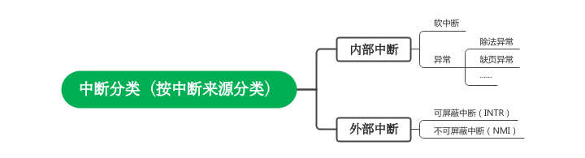

# <h1>中断与中断控制器</h1>

## 一、学习目标

* 认识中断
* 了解中断发生过程
* 了解中断控制器（8259A）
* 了解中断门描述符
* 了解中断描述符表

## 二、笔记内容

### 1、驱动操作系统的中断

#### 1.1 中断的概念

在进入操作系统内核后，可以把操作系统看成一个死循环：

```c
while(1)
{
    // 操作系统代码
}
```

操作系统一直在执行循环内的某些代码，只能一直执行某个任务，但平时使用的操作系统可以同时执行多个任务。
这是因为操作系统是由中断驱动的。

* 中断
  CPU获知了计算机中发生了某些事，CPU停下当前执行的任务，去处理需要立刻执行的任务，任务执行完后继续返回当前任务的过程叫做中断。

操作系统是由中断驱动的，对比轮询能大大提升操作系统的效率。

在x86 CPU中个可供使用的中断号共256个：从0~255，其中，0~31保留供Intel 64 和 IA-32使用；32~255号则供用户使用，这些中断号通常留给额外的I/O设备使用。

* 中断错误码

有些中断会在栈中压入错误码，用来指明中断发生在哪个段上，错误码的格式与段选择子很像，它可以多种表中检索描述符，错误码的结构如下：

| 31~16   | 15~3      | 2   | 1   | 0   |
| ------- | --------- | --- | --- | --- |
| 保留，全部置0 | 选择子高13位索引 | TI  | IDT | EXT |

低3位属性用来修饰错误码中的选择子指向哪个描述符。

* EXT(EXTernal event)

用来表示中断源是否来自CPU外部，如果中断不是可屏蔽中断（NMI）或外部设备，EXT=1, 否则为0。

* IDT

表示选择子是否指向IDT,IDT=1表示选择子指向IDT,否则指向全局描述符或局部描述符表。

* TI

意义与段描述符表选择子中相同，如果TI=1时从GDT中检索描述符，TI=0从局部描述符表中检索描述符，只有IDT=0时，该位才起作用。

当一个错误码全部为零的时候意味着，中断发生与特定的段无关或者引用了一个空描述符。

#### 1.2 中断的分类

* 中断分类预览



按`中断来源分类`，中断可以分成来自CPU内部的`内部中断`和来自CPU外部的`外部中断`。

> 内部中断:
> 
> 来自CPU内部的中断，分成软中断和异常
> 
> (1)软中断
> 
> 由软件主动发起的中断，来自软件。使用`int 8位立即数`发起中断
> 
> 此外还有既可以被归为软中断又可以被归类为异常的指令。`int3`断点调试，`into`中断溢出指令，`bound`检查数组索引越界，`ud2`未定义指令
> 
> (2)异常
> 
> 在运行期间由CPU内部错误引起的中断
> 按造成的结果分成三类：
> 
> | 类型    | 说明                                   |
> | ----- | ------------------------------------ |
> | Fault | 可以被修复的异常                             |
> | Trap  | CPU设置的陷阱，比如int3中断调试                  |
> | Abort | 终止，最严重的异常，可能由硬件错误或系统数据错误引起，没有继续运行的必要 |

> 外部中断:
> 
> 来自CPU外部，来源必须是某个硬件，因此，也可以称为硬件中断，比如网卡，键盘。
> 
> CPU的引脚有限，因此提供了两个引脚，用于处理外部中断，一个是INTR(interrupt)和NMI(No Maskable Interrupt)
> 
> (1)可屏蔽中断（INTR）
> 
> 这类中断不会导致系统宕机，CPU可以将`eflags`的`IF`位设置为1来忽略他们，比如硬盘、键盘、网卡。
> 
> (2)不可屏蔽中断(NMI)
> 
> 这类中断发生时，意味着系统中发生了`严重错误`,该错误表示不具备操作系统正常与运行的条件，比如内存读写错误，比如硬盘错误。

### 2、中断发生过程

#### 2.1、中断描述符表（IDT, Interrupt Description Table）

与GDT和LDT类似，IDT（中断描述符表）是在保护模式下用来保存中断处理程序入口的表，当CPU接收到中断时，会从表中查找对应的中断处理程序。

中断描述表中可能保存着`中断描述符`、`任务门`或`陷阱门`，它们都是门中的一种。

在学习中断相关的过程中主要使用`中断描述符`。

#### 2.2、中断描述符

每个门共64bit,中断描述符是门的一种，以下是中断描述符的详情：

* 高32位

| 属性位范围 | 31~16                    | 15  | 14~13 | 12  | 11~8        | 7   | 6   | 5   | 4~0 |
|:-----:|:------------------------ | --- | ----- | --- | ----------- | --- | --- | --- | --- |
| 属性描述  | 中断处理程序代码在目标代码段内的偏移量31~16 | P   | DPL   | S=0 | TYPE=0b0110 | 0   | 0   | 0   | 未使用 |

* 低32位

| 属性位范围 | 31~16              | 15~0                    |
|:-----:| ------------------ | ----------------------- |
| 属性描述  | 中断处理程序目标代码段段描述符选择子 | 中断处理程序代码在目标代码段内的偏移量15~0 |

* P 表示该代码段是否在内存中存在，如果存在P=1
* DPL描述符特权级，配合CPL,RPL实现夸权限调用和保护，在学习操作系统的过程中DPL设置为0
* S位，0时表示系统段，紧接着是类型，中断描述符固定为`0110`，7~5默认，设置为4~0未使用。

#### 2.3、中断发生过程

根据中断来源，中断号有两种来源：

* 外部中断由中断控制器处理后，提供中断向量号给CPU
* CPU内存根据运行情况产生中断向量号

现在介绍获得中断向量后，中断过程：

##### （1）CPU根据中断向量号定位中断门描述符

中断向量号是中断描述符表的索引，获取中断向量后，中断号乘8后与IDTR相加得到中断向量化号对应的中断处理程序的中断描述符。

##### （2）CPU进行特权级检查

a. 检查特权级下限

如果中断是由int n, int3或into引发的，他们共同的特点是由用户进程中主动发起的，需要检查当前特权级（CPL）和门描述符特权级（DPL），如果CPL的权限大于DPL(在数值上，CPL <= DPL),检查通过，否则处理器抛出异常。

b.检查特权级上限

处理器检查当前特权级（CPL）和门描述符中记录的选择子的对应的DPL, 如果CPL权限小于目标代码段的DPL(数值上，CPL > DPL),检查通过。否则处理器抛出异常。

即，除了使用iret从高特权级返回，特权级只能从低向高转移。

* 如果中断由设备或异常引起，检查的过程与b一样。

##### （3）执行中断处理程序

特权检查通过意味着中断程序需要被执行。

a. 更新寄存器

加载中断处理程序的CS和EIP,如果发生特权转移（向高特权级转移，原文：numerically lower privilege level）需要更换新的栈，会加载SS和ESP。

b. 压栈

* 如果特权级转移了，所有的压栈操作都会在新的栈中操作，如果特权级不变（相同特权级）所有压栈会在原来的栈中发生。

如果发生了栈交换（使用新的栈），向栈中压入SS(扩展至32位，高16补0)和ESP

压入EFLAGS。

压入CS(扩展至32位)和EIP

如果中断有错误码，在此压入错误码。

c. 更新EFLAGS

中断发生时CPU会自动把NT和TF置零，如果中断对应的描述符是中断描述符，IF会被置零，避免出现相同的中断，导致中断嵌套从而引起一般性保护（GP）。

* NT(Nest Task Flag)

任务嵌套，用来记录是否发生了任务嵌套，当存在任务嵌套时置1，并把旧任务的TSS保存到新TSS的`上一个TSS指针`中，在执行完新任务后返回继续执行旧任务。

* TF

TF=0时禁止任务单步执行，用于debug。【存在疑问】

* IF

中断对应的门描述符类型为任务门或陷阱门时不会置1。

d. 执行中断处理程序

执行需要的操作。

e. iret或iretd返回

执行完中断处理程序后，需要返回到挂起的任务中，根据特权级是否变化，此时CPU会自动出栈，如果特权级发生变化还需要更换栈，恢复之前的执行环境。

* 需要注意的是，有的中断会压入错误码，需要在返回之前跳过错误码，需要手动处理。

### 3、中断控制器

中断号由两种方式提供，一种是由CPU内部产生，一种是中断控制器产生，通过学习可编程中断控制器（PIC, ）8259A来了解中断控制器。

PIC用于管理和控制可屏蔽中断。PIC可以屏蔽外设中断，提供优先级控制，向CPU提供中断向量号等。可以通编程控制这些功能。

每片8259A只能管理8个中断（IR0~IR7），但8259A可以级联在一起，N片8259A可以管理7N+1个中断，级联时只有一片master, 其余均为slave，且只有主片才向CPU的INT发送中断信号。

#### 3.1 8259A工作过程

（1）重要寄存器

* 中断屏蔽寄存器（IMR, Interrupt Mask Register）

8位寄存器，记录屏蔽了那些中断，对应的位置置1时表示屏蔽，置0时表示允许。

* 中断请求寄存器（IRR, Interrupt Request Register）

8位寄存器，需要等待处理的中断号位置被被置1。

* 优先级仲裁器（PR, Priority Resolver）

根据中断入口号（IR0~-IR7）判断优先级，序号越小，优先级越高。

* INT

接口，用户向CPU发送INTR信号，表示有新的中断发生。

* INTA

接口，用于CPU向8259A发送INTA信号。

* 中断服务寄存器(ISR, Interrupt Service Register)

8位寄存器，保存正在处理的中断，对应IR接口置1.

（2）工作过程

初始化8259A后，根据IMR中屏蔽规则把需要处理的中断保存在IRR中。

接下来，则是由PR判断出新的中断或多个同时发生的中断哪个中断优先级更高。

判断出优先级后8259A通过INT接口向CPU发送INTR信号，在CPU准备完成后向8256A发送INTA信号，8259A接受信号后将ISR中对应的中断后标记为置1，表示开始处理对应中断，并把IRR中对应的位置0。

完成上述动作后吗，CPU再次发送INTA信号给8259A以获取中断向量号。

8259A根据设置向CPU提供对应的向量号。

#### 3.2 5259A初始化

##### 3.2.1 初始化命令字（ICW, Initialization Command Words）

用来保存初始化命令，共4个8位寄存器（ICW1~ICW4）。

（1）ICW1

用来初始化8259A的连接方式，和中断信号的触发方式，端口是主片0x20,从片0xA0。

| 7   | 6   | 5   | 4   | 3    | 2   | 1     | 0   |
| --- | --- | --- | --- | ---- | --- | ----- | --- |
| 0   | 0   | 0   | 1   | LTIM | ADI | SINGL | IC4 |

* IC4

表示是否需要写入ICW4,置1表示后面要写入ICW4,置0时表示不写入，x86系统必须写入ICW4,故学习过程中置1

* SINGL

标识连接方式，1时表示单片，0表示级联。级联时，主片和从片都需要写ICW3

* ADI 

call address interval，用来设置8085的调用时间间隔，x86不需要设置。

* LTIM

表示level/edage trigger mode， 用来设置中断触发方式，置1时表示电平触发，置0表示边缘触发。在学习中设置为边缘触发（置0）

* 第四位控制字标识

此处默认置为1，用于辨识ICW、OCW2和OCW3

* 5~7位

用于8085处理器，此处置0。

（2）ICW2

用于设置，设置中断向量的起始号，主片端口0x21,从片端口0xA1。设置时只需要设置IR0对应的中断号，IR1~IR7会从起始中断号顺延自动设置。

| 7   | 6   | 5   | 4   | 3   | 2   | 1   | 0   |
| --- | --- | --- | --- | --- | --- | --- | --- |
| T7  | T6  | T5  | T4  | T3  | ID2 | ID1 | ID0 |

T3~T7五位需要开发者自己设置，D0~D2三位则由8259A维护，高5位加低3位表示IR对应的中断号，比如从0x20（32）开始。

（3）ICW3

级联时，对主片和从片的标识不同：主片时，置1的那一位表示连接了从片；从片时，只使用低3位，表示自己连接到了主片哪个IR上，比如，从片连接主片IR2时，主片需要设置为0x04(0b0000_0100),从片设置为0x02(0b0000_0010)。

主片端口0x21,从片端口0xA1

| 7   | 6   | 5   | 4   | 3   | 2   | 1   | 0   |
|:---:|:---:|:---:|:---:|:---:|:---:|:---:|:---:|
| 0   | 0   | 0   | 0   | 0   | D2  | D1  | D0  |

（4）ICW4

ICW4用于设置8259A的工作模式 ，主片端口0x21,从片端口0xA1。

| 7   | 6   | 5   | 4    | 3   | 2   | 1    | 0   |
| --- | --- | --- | ---- | --- | --- | ---- | --- |
| 0   | 0   | 0   | SFNM | BUF | M/S | AEOI | uPM |

ICW4有的低位需要依赖高位。

* 7~5位未定义，置0

* SFNM(特殊全嵌套模式，Special Fully Nested Mode)

置0时表示全嵌套模式，为1时表示特殊全嵌套模式。

* BUF

标识8259A是否工作在缓冲模式，置0时表示非缓冲模式。

* M/S

用来标识级联模式时该片8259A是主片还是从片，工作在缓冲模式时有效 ，置0表示是从片，置1是表示是主片。

* AEOI（自动结束中断， Auto End Of Interrupt）

8259A在收到结束中断后才能继续处理下一个中断，用于设置是否自动结束中断。若AEOI为零时表示非自动模式，需要手动发送EOI指令给8259A,处于级联时主从片都需要发送，用到OCW发送。

* uPM

为兼容老处理器设置，置0时表示8080或8085处理器，置1表示x86处理器。学习中置1。

##### 3.2.2 操作命令字(Operation Command Words)

共3个8位寄存器，用来保存操作命令字。

（1）OCW1

用来屏蔽外部设备的中断信号，设置IMR寄存器，主片端口0x21,从片端口0xA1

受EFLAGS的IF约束，IF位为零时，可屏蔽中断都会被屏蔽。

| 7   | 6   | 5   | 4   | 3   | 2   | 1   | 0   |
| --- | --- | --- | --- | --- | --- | --- | --- |
| M7  | M6  | M5  | M4  | M3  | M2  | M1  | M0  |

M0~M7对应IRQ0~IRQ7，某位置为1时表示对应的IRQ被屏蔽。

（2）OCW2

用来设置中断结束模式和优先级模式。主片端口0x20,从片端口0xA0。

| 7   | 6   | 5   | 4   | 3   | 2   | 1   | 0   |
| --- | --- | --- | --- | --- | --- | --- | --- |
| R   | SL  | EOI | 0   | 0   | L2  | L1  | L0  |

* R(Rotation)、SL(Specific Level)

用于表示是否使用循环模式设置优先级。

R置0时表示固定优先级，IR0优先级最高，IR7优先级最低；

R置1时表示循环优先级，置SL位为1后可通过L0~L2指定初始最低优先级的IRQ。

R=1时，设置IRQ5优先级最高，则，初始优先级为：

IRQ6 > IRQ7 > IRQ0 > IRQ1 > IRQ2 > IRQ3 > IRQ4 > IRQ5

处理完IRQ6后，它的优先级降至最低，优先级情况为：

IRQ7 > IRQ0 > IRQ1 > IRQ2 > IRQ3 > IRQ4 > IRQ5 > IRQ6

* EOI（End Of Interrupt）

中断结束命令，置EOI为1，则ISR对应的位清零，表示当前的中断结束，AEOI设置为0时才生效。

* L2~L0

用于EOI时表示被中断的优先级，用于优先级循环时用于指定起始最低的优先级。

* `R、SL和EOI需要配合使用，请款较为复杂`

（3）OCW3

用来设定特殊屏蔽方式及查询方式。主片端口0x20, 从片端口0xA0。

| 7   | 6    | 5   | 4   | 3   | 2   | 1   | 0   |
|:---:|:----:|:---:|:---:|:---:|:---:|:---:|:---:|
| /   | ESMM | SMM | 0   | 1   | P   | RR  | RIS |

* ESMM(Enable Special Mask Mode)和SMM(Special Mask Mode)

这两位需要配合一起使用，用来启用或禁用特殊屏蔽模式，当ESMM和SMM都置1的时候，才表示工作在特殊屏蔽模式。

* 4~3位01是OCW3的表示，8259A通过这两位判断是哪个控制字

* P（Poll command）

查询命令，当P设置为1时，设置8259A为查询模式，可以通过读取寄存器查看中断处理情况。

* RR（Read Register）

读取命令寄存器，和RIS配合在一起使用。置1时才可以读取寄存器。

* RIS （Read Interrupt register Select）

所读取寄存器的选择位，用来标识待读取的寄存器，RR置1时才起作用；置0时表示要读取IRR寄存器，置1时表示要读取ISR寄存器。

### 3.3 ICW和OCW的写入和识别

* 写入

对于ICW,必须按顺序依次写入ICW1~ICW4，主片和从片都一样。

* 识别

ICW1、OCW2和OCW3都是用偶地址端口0x20（主片）或0xA0（从片写入）,疑问：如何区分？

通过第4~3为组合来识别。

| 控制字  | 第4位 | 第3位 |
| ---- | --- | --- |
| ICW1 | 1   | /   |
| OCW2 | 0   | 0   |
| OCW3 | 0   | 1   |

ICW2~ICW4和OCW1都是用奇地址端口0x21（主片）或0xA1写入，疑问：如何确定OCW1?

在写入ICW后才需要写入OCW，故之后写入奇地址端口的就是OCW1。

## 三、参考资料

《操作系统真像还原》郑刚·著 7.1~7.6.1

《因特尔白皮书》 Volume 3: System Programming Guide Chapter 6 Interrupt and Exception Handling