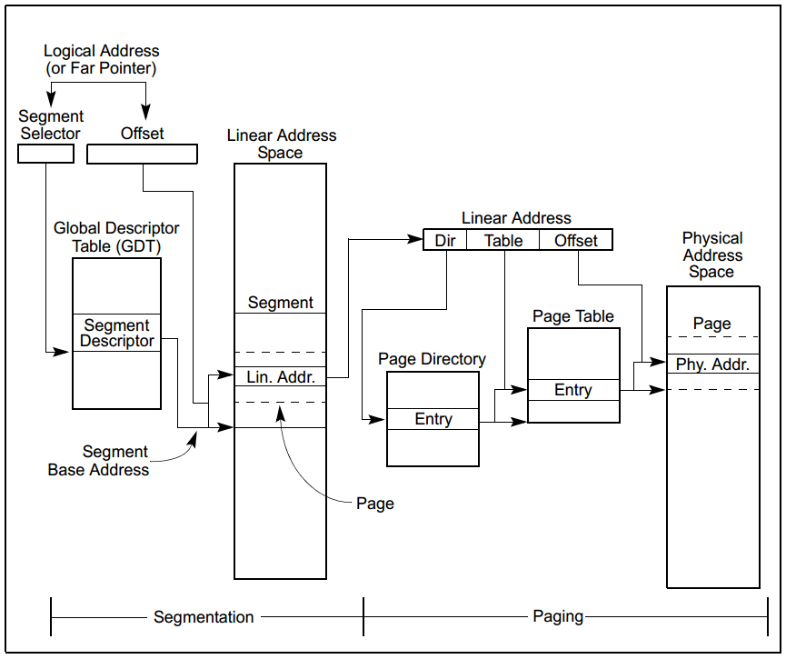
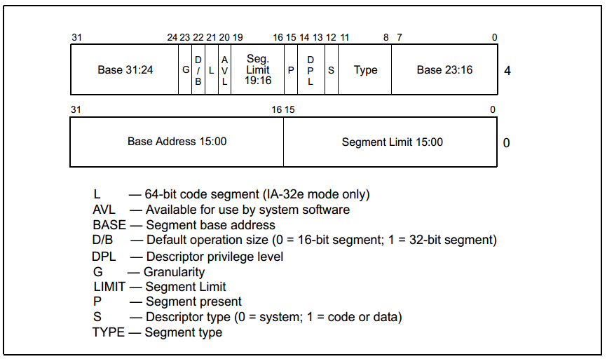
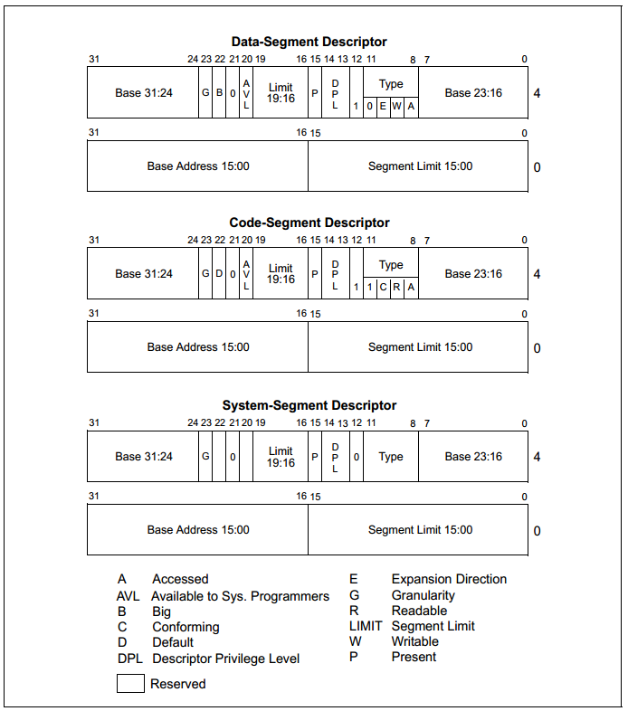
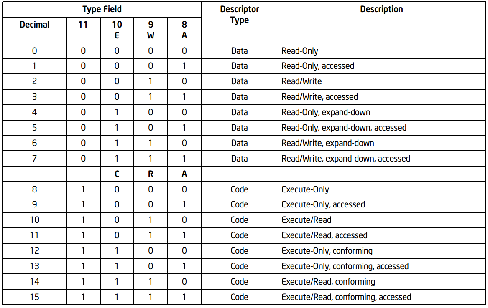
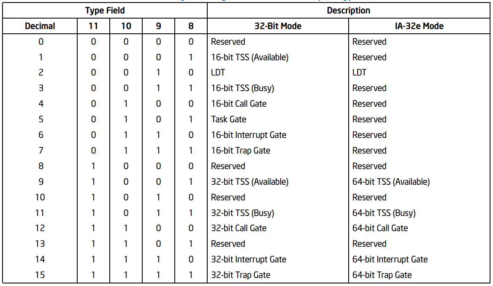

# <h1 align="center">保护模式</h1>

## 一 参考资料

【网上资料】[Protect Mode(https://wiki.osdev.org/Protected_Mode)](https://wiki.osdev.org/Protected_Mode) 

【网上资料】[Global Descriptor Table(https://wiki.osdev.org/Global_Descriptor_Table)](https://wiki.osdev.org/Global_Descriptor_Table) 

【使用手册】Intel 64 and IA-32 Architectures Software Developer’s Manual  Volume 3:System Programming Guide Chapter 3

【书】一个64操作系统的设计与实现 6.1~6.4

【书】操作系统真像还原 4.1~4.3

## 二 保护模式概述

### 2.1 保护模式

8086时期，CPU通过`段基址：偏移地址`的方式访问内存，它的`逻辑地址`直接指向物理内存，而且没有限制，这导致了 以下安全问题：

* 操作系统和用户程序都拥有相同的权限
* 代码（无论用户程序或内核程序）直接访问物理内存
* 用户程序可以自由地修改`段基址`,导致可以访问全部1MB内存

此外，还有效率和可用性问题：

* 每64KB需要更新段寄存器
* 每次只能运行一个程序
* 只有1MB的内存空间

为了解决以上问题，Intel 推出了`Intel 80286`CPU,它是`实模式`和`保护模式`的分水岭，同时也把`地址总线`从20条升级到24条，支持多达16MB内存。

而后不就Intel推出了第一款32位CPU `Intel 80386`,32位`地址总线`，可寻址4GB的物理内存，同时支持多用户、多任务。

### 2.2 进入保护模式步骤

```assembly
; 1、打开A20地址线
in al, 0x92
or al, 0000_0010B
out 0x92, al

; 2、加载GDT
cli	;关中断
lgdt [GDT_PTR]

; 3、置CR0.PM位为1
mov eax, cr0
or eax, 0000_0001B
mov cr0, eax
; jmp dword SELECT_CODE : offset
```


## 三 保护模式下的内存管理

保护模式下有两种内存管理机制，一种是`分段管理`，一种是`分页管理`，其中`分页管理`是可选的。在加载内核阶段先使用段管理模式。

其中段管理模式，又分成`基础平坦模式`，`保护平坦模式`、`多段模式`。这里仅关注`基础平坦模式`。



### 3.1 逻辑地址（Logical Address）、线性地址(Linear Address)、物理地址(Physical Address)

在段管理模式下，逻辑地址由`段选择子:32位偏移地址`组成，`线性地址`=`段基址 + 32位偏移地址`，`线性地址`直接指向`物理地址`。

在分页管理模式下，`线性地址`还需要再次转换才能访问到物理地址。

### 3.2 段描述符（Segment Descriptor）

为了区分内存的段以及对相应段做出保护，需要一个东西来保存该段内存的属性，把这个东西叫做`段描述符（Segment Descriptor）`。它是一段长达64bit的数据。



| 属性 | 说明                                       |
| ---- | ------------------------------------------ |
| G    | 该段内存粒度，0的时候粒度为1B,1的时候为4KB |
| D/B  | 指有效位大小以及操作数大小，兼容286考虑。  |
| L    | 仅IA-32e模式需要处理，32位时置0            |
| AVL  | 对用户来说是否可用。                       |
| P    | 段是否存在位。                             |
| DPL  | 描述符特权级                               |
| S    | 描述符类型，0=system, 1 = code or data     |
| Type | 段类型，根据描述符类型又分成多种情况       |

段描述符类型如下：



* 代码和数据段时属性说明



* 系统段时属性说明



### 3.3 段描述符表

每个段描述符为64位，这么大的数据用寄存器保存不是明智的选择，更何况可能还有其他段描述符，于是把段描述符保存在内存中，需要的时候再把数据缓存到CPU中。

段描述符表就是一个保存段描述符的数组，最大长度是8192（2^13）它有两种类型，一种是`全局描述符表（global descriptor table，GDT）`，一种是`局部描述符表（local descriptor table， LDT）`。

* GDT

一个系统必须有一个GDT,该GDT可共这个系统中所有程序和任务使用。

* LDT 

可以由一个到多个，可由任务自行创建。

## 3.4 段选择子

`段选择子`是一个指向段描述符的16bit的标识符，它指向描述符在描述符表中的位置。

段选择子结构如下：


