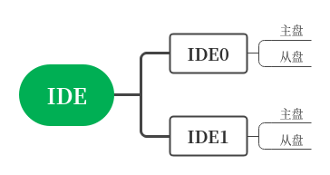

# <h1 align="center">读取硬盘</h1>

## 1 存储发展简史

自计算机诞生以来，信息的存储越来越重要，存储介质也随着技术的发展不断地在更新。

我大致把他们分成几个时期，`纸带时期`、`磁带时期`、`软盘时期`、`硬盘时期（HDD）`、`固态时期`。

除了这些还有CD，DVD等，以及处于超级前沿的基因存储技术等等。

## 2、硬盘简介

### 2.1 硬盘结构

#### 2.1.1 总体示意图

由磁片、磁头和磁盘控制器构成。

#### 2.1.2 磁片结构

每片磁片被分成了`磁道`、`扇区`等等。

图中粉色部分为一个磁道，我这里标注成柱面,蓝色标记位置为一个扇区。

### 2.2 硬盘读写

每读取一个扇区，需要在众多的盘片中找到对应的面号、磁道号和扇区。我们称这个过程为`寻道`，如果写入或读取的数据跨磁道存储，就需要磁头频繁移动，让后再寻找对应扇区，这回严重影响机械硬盘的读写速度，于是，工程师们决定先写柱面，再换磁道。

假设一个机械硬盘有两个盘片，在写数据时，0面0道写满后写1面0道，直到3面0道写满后开始写0面1道，这样就减少了磁头的移动。

### 2.3 硬盘接口

以前硬盘和硬盘控制器是分开的，后来出现了`集成设备电路（Integrated Drive Electronics, IDE）`，IDE的影响巨大，于是制定了硬盘标准`ATA(Advanced Technology Attachment)`，再之后出现了串行接口（Serial ATA, SATA），于是老的只能改叫并行接口（Parallel ATA, PATA）。

PATA时期主板一般支持四块硬盘，主板上一般有两个PATA接口，工程师们称之为通道，IDE0又称Primary通道，IDE1又称Secondary通道。

每个通道可以挂载两个硬盘，分别是`主盘(master)`、`从盘（Slave）`。

SATA出现后，只要主板支持可以挂载更多的硬盘，但考虑到兼容性，通道和主从盘的概念保留了下来，即他们是通用的。

## 3、硬盘操作

目前读取硬盘有两种方式可以选择，一种是中断，但只能在实模式下使用，一种是端口控制的方式，主要介绍端口控制的方式。

硬盘中的扇区在物理上使用`柱面（Cylinder）-磁头（Head）-扇区(Sector)`来定位的，简称为`CHS`。

使用`CHS`方式访问硬盘，过程较为繁琐，于是把扇区从0开始编号，并把这种编号方式叫做`逻辑块地址（Logical Block Address， LBA）`。

端口访问可以使用`CHS`、`LBA`,后者又有两种模式。

| LBA模式 | 访问大小                       | 备注  |
| ----- | -------------------------- | --- |
| LBA28 | 可以访问2^28=268435456扇区，128GB | 选用  |
| LBA48 | 可以访问2^48个扇区，128PB          |     |

接下来详细介绍控制端口和寄存器：

<table>
    <tr>
        <th rowspan="2">寄存器类别</th><th colspan="2">IO端口</th><th colspan="2">端口用途</th>
    </tr>
    <tr>
        <td>Primary通道</td><td>Secondary通道</td><td>读操作时</td><td>写操作时</td>
    </tr>
    <tr>
        <td rowspan="8">Command block Registers</td><td>0x1F0</td><td>0x170</td><td>Data</td><td>Data</td>
    </tr>
    <tr>
        <td>0x1F1</td><td>0x171</td><td>Error</td><td>Features</td>
    </tr>
    <tr>
        <td>0x1F2</td><td>0x172</td><td>Sector count，0x00时表示256个扇区</td><td>Sector count,0x00时表示256个扇区</td>
    </tr>
    <tr>
        <td>0x1F3</td><td>0x173</td><td>LBA low，存LAB0~7</td><td>LBA low，存LAB0~7</td>
    </tr>
    <tr>
        <td>0x1F4</td><td>0x174</td><td>LBA mid，存LAB8~15</td><td>LBA mid，存LAB8~15</td>
    </tr>
    <tr>
        <td>0x1F5</td><td>0x175</td><td>LBA high，存LAB16~23</td><td>LBA high，存LAB16~23</td>
    </tr>
    <tr>
        <td>0x1F6</td><td>0x176</td><td>Device</td><td>Device</td>
    </tr>
    <tr>
        <td>0x1F7</td><td>0x177</td><td>status</td><td>Command</td>
    </tr>
    <!--tr>
        <td>Control block Registers</td><td>0x3F6</td><td>0x376</td><td>Alternate status</td><td>Device Control</td>
    </tr-->
</table>

上面的端口，除了Data（0x1F0/0x170）是16位外，其他都是8位，根据用途主要介绍device（0x1F6/0x176）、Command（0x1F7/0x177）。

* device详情

| 位   | 7   | 6                    | 5   | 4               | 0~3      |
|:---:|:---:|:--------------------:|:---:|:---------------:|:--------:|
| 用途  | 1   | 是否启用LBA, 0=CHS,1=LBA | 1   | 标记主从盘，0=主盘，1=从盘 | LBA24~27 |

* Command详情

在操作前这个寄存器需要写入操作命令。

| 命令   | 用途   |
|:----:| ---- |
| 0x20 | 读取扇区 |
| 0x30 | 写入扇区 |

在写入命令后，硬盘就会开始工作，在读取硬盘的情况下command端口用来保存结果信息。

| 位   | 7           | 6         | 5   | 4   | 3                | 2   | 1   | 0                       |
|:---:| ----------- | --------- | --- | --- | ---------------- | --- | --- | ----------------------- |
| 用途  | 置1时表示设备设备正忙 | 置1时表示设备就绪 |     |     | 置1时表示数据准备完成，可以输出 |     |     | 置1时表示存在错误，详细信息在Error端口中 |

* 表格中空的位置有其他用处

## 4 硬盘读取顺序

在写入Command命令后，硬盘就会开始工作，故写command端口的操作必须最后进行

（1）写入读取扇区数

（2）写入LBA28

（3）写入device

（4）写command

（5）检测数据状态

（6）移动数据
